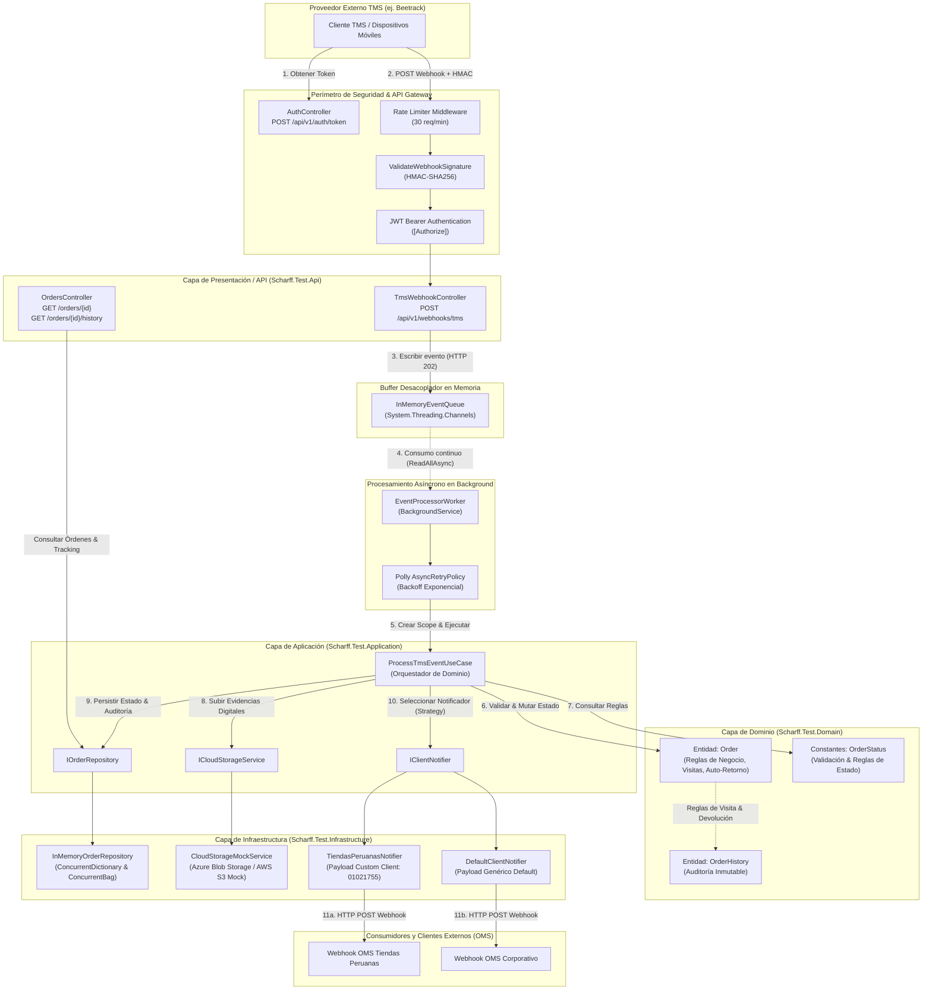
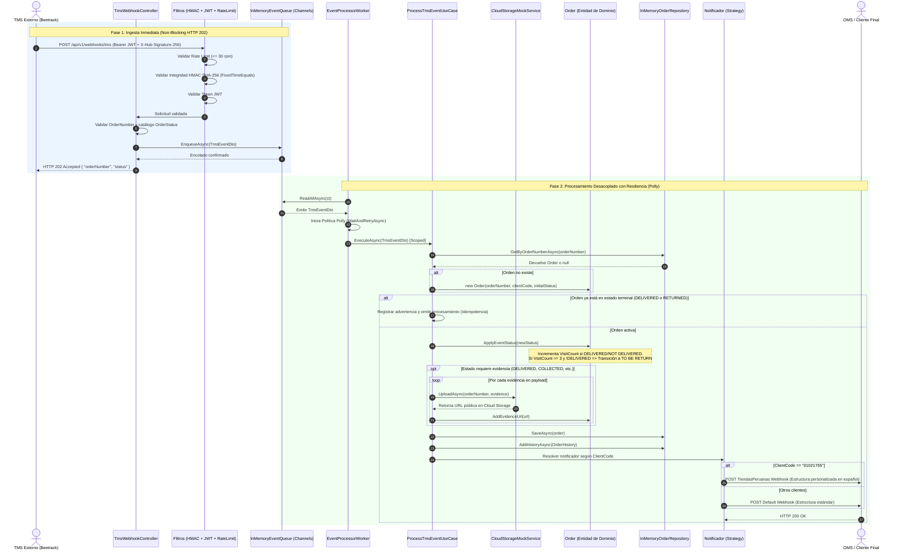
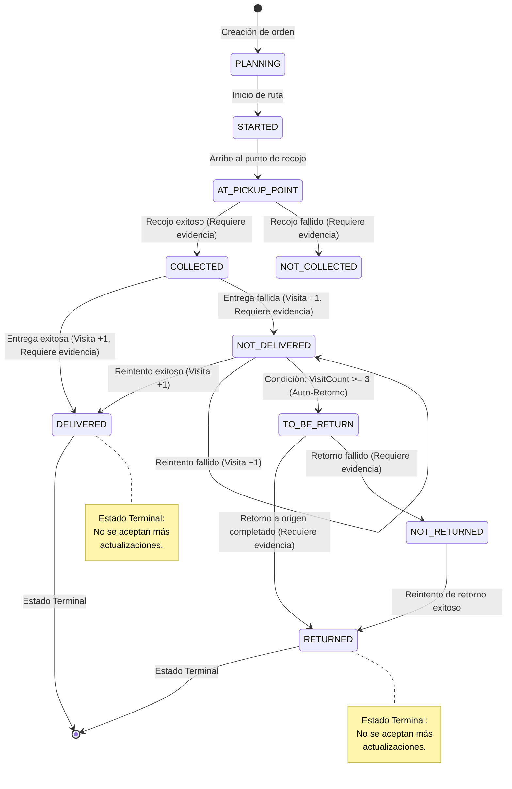
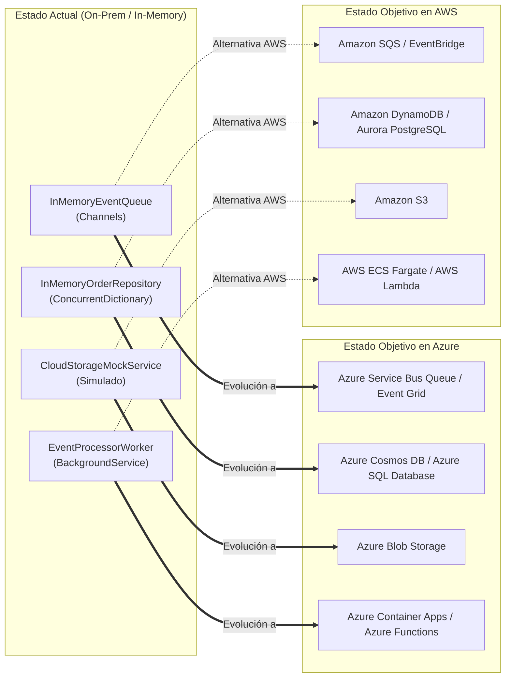

# Documento de Arquitectura de Software (Architecture.md)
## Logistic TMS to OMS Integration Service (.NET 10)

Este documento describe la arquitectura global, los componentes y artefactos implementados, los flujos de comunicación e integración, el modelo de datos/dominio, los mecanismos de resiliencia y seguridad, así como la hoja de ruta para despliegues de misión crítica en la nube.

---

## 1. Visión General del Sistema

El sistema **Logistic TMS to OMS Integration Service** actúa como un middleware corporativo de integración orientado a eventos (EDA - *Event-Driven Architecture*), diseñado para sincronizar en tiempo real el ciclo de vida de pedidos entre un TMS externo (ej. Beetrack) y el OMS / Clientes Finales de la compañía (ej. Tiendas Peruanas y clientes genéricos).

### Principales Desafíos Resueltos:
* **Ingesta de alta concurrencia sin bloqueos:** Los Webhooks entrantes reciben confirmación inmediata (`HTTP 202 Accepted`) desacoplando la ingesta del procesamiento.
* **Tolerancia a fallos y resiliencia:** Políticas de reintento exponencial con [Polly](https://github.com/App-vNext/Polly) ante indisponibilidades de servicios externos.
* **Integridad y Seguridad OWASP:** Autenticación por token Bearer (JWT), validación de firmas criptográficas HMAC SHA-256 (`X-Hub-Signature-256`), limitación de tasa (Rate Limiting) y control de tamaño de payload (2MB).
* **  Registro de transiciones de estados, control estricto de estados terminales, cálculo automático de reintentos de visita y derivación a devolución (`TO BE RETURN`) tras 3 intentos fallidos.
* **Estrategia multicliente:** Despacho de notificaciones multiformato personalizadas según el cliente contratante (Patrón Strategy).

---

## 2. Diagramas de Arquitectura

### 2.1. Diagrama de Componentes y Capas (Clean Architecture & EDA)



---

### 2.2. Diagrama de Secuencia End-to-End (Ingesta y Procesamiento Asíncrono)



---

### 2.3. Diagrama de Estados del Ciclo de Vida del Pedido (State Machine)



---

## 3. Desglose de Artefactos de la Solución

El proyecto sigue rigurosamente los principios de **Clean Architecture**, distribuyendo la solución en 4 capas concéntricas más la suite de pruebas automatizadas:

```
Scharff.Test/
├── Scharff.Test.Domain/           # Capa de Dominio (Núcleo empresarial sin dependencias)
├── Scharff.Test.Application/      # Capa de Aplicación (Casos de uso, interfaces, DTOs)
├── Scharff.Test.Infrastructure/   # Capa de Infraestructura (Adaptadores técnicos, colas, workers)
├── Scharff.Test.Api/              # Capa de Presentación (Controladores REST, filtros de seguridad)
└── Scharff.Test.UnitTests/        # Pruebas Unitarias Automatizadas
```

### 3.1. Capa de Dominio (`Scharff.Test.Domain`)
Contiene las reglas de negocio puras, entidades e invariantes de dominio:
* [OrderStatus.cs](file:///d:/.NET%20ESTUDIOS/Scharff.Test/Scharff.Test.Domain/Constants/OrderStatus.cs):
  * Catálogo de estados válidos (`PLANNING`, `STARTED`, `AT PICKUP POINT`, `COLLECTED`, `NOT COLLECTED`, `DELIVERED`, `NOT DELIVERED`, `TO BE RETURN`, `RETURNED`, `NOT RETURNED`).
  * Conjunto de estados terminales (`DELIVERED`, `RETURNED`).
  * Conjunto de estados que incrementan visitas (`DELIVERED`, `NOT DELIVERED`).
  * Conjunto de estados que exigen evidencias fotográficas/digitales.
* [Order.cs](file:///d:/.NET%20ESTUDIOS/Scharff.Test/Scharff.Test.Domain/Entities/Order.cs):
  * Entidad raíz con encapsulamiento.
  * `ApplyEventStatus(string newStatus)`: Valida que la orden no esté en estado terminal, incrementa el contador de visitas (`VisitCount`) y ejecuta la regla de auto-retorno si `VisitCount >= 3` hacia `TO BE RETURN`.
  * `AddEvidenceUrl(string url)`: Almacena evidencias consolidadas asociadas a la orden.
* [OrderHistory.cs](file:///d:/.NET%20ESTUDIOS/Scharff.Test/Scharff.Test.Domain/Entities/OrderHistory.cs):
  * Modelo inmutable para auditoría y trazabilidad histórica de eventos logísticos con fecha de evento y marca de tiempo de procesamiento (`ProcessedAt`).

---

### 3.2. Capa de Aplicación (`Scharff.Test.Application`)
Orquesta la lógica de negocio coordinando entidades y contratos abstractos:
* [ProcessTmsEventUseCase.cs](file:///d:/.NET%20ESTUDIOS/Scharff.Test/Scharff.Test.Application/UseCases/ProcessTmsEventUseCase.cs):
  * Caso de uso principal. Consulta/crea órdenes, valida estados terminales (idempotencia), invoca carga de evidencias digitales, actualiza estado de la orden, registra historial de auditoría y ejecuta el notificador correspondiente.
* **Contratos e Interfaces:**
  * [IOrderRepository.cs](file:///d:/.NET%20ESTUDIOS/Scharff.Test/Scharff.Test.Application/Interfaces/IOrderRepository.cs): Abstracción para persistir órdenes y consultar historial de tracking.
  * [ICloudStorageService.cs](file:///d:/.NET%20ESTUDIOS/Scharff.Test/Scharff.Test.Application/Interfaces/ICloudStorageService.cs): Abstracción para subida de evidencias digitales.
  * [IClientNotifier.cs](file:///d:/.NET%20ESTUDIOS/Scharff.Test/Scharff.Test.Application/Interfaces/IClientNotifier.cs): Contrato para la estrategia de notificación saliente con método `AppliesTo(string clientCode)`.
  * [ITokenService.cs](file:///d:/.NET%20ESTUDIOS/Scharff.Test/Scharff.Test.Application/Interfaces/ITokenService.cs): Contrato para generación de tokens de autenticación JWT.
* **DTOs y Configuración:**
  * [TmsEventDto.cs](file:///d:/.NET%20ESTUDIOS/Scharff.Test/Scharff.Test.Application/DTOs/TmsEventDto.cs): Records inmutables que mapean la estructura de eventos recibidos (`TmsEventDto`, `TmsDetailsDto`, `TmsEvidenceDto`).
  * [IntegrationOptions.cs](file:///d:/.NET%20ESTUDIOS/Scharff.Test/Scharff.Test.Application/Configuration/IntegrationOptions.cs) y [JwtSettings.cs](file:///d:/.NET%20ESTUDIOS/Scharff.Test/Scharff.Test.Application/Configuration/JwtSettings.cs): Strongly-typed options para configuración del sistema.
  * [CustomDateTimeConverter.cs](file:///d:/.NET%20ESTUDIOS/Scharff.Test/Scharff.Test.Application/Common/CustomDateTimeConverter.cs): Conversor JSON tolerante a formatos de fecha ISO 8601 y formatos habituales de TMS (`yyyy-MM-dd HH:mm:ss`).

---

### 3.3. Capa de Infraestructura (`Scharff.Test.Infrastructure`)
Implementa los detalles técnicos, protocolos y almacenamiento:
* [InMemoryEventQueue.cs](file:///d:/.NET%20ESTUDIOS/Scharff.Test/Scharff.Test.Infrastructure/Queues/InMemoryEventQueue.cs):
  * Implementación de cola basada en `System.Threading.Channels.Channel<TmsEventDto>` con lectura y escritura asíncrona de alto rendimiento y cero contención.
* [EventProcessorWorker.cs](file:///d:/.NET%20ESTUDIOS/Scharff.Test/Scharff.Test.Infrastructure/Workers/EventProcessorWorker.cs):
  * Servicio hospedado en segundo plano (`BackgroundService`).
  * Desacopla la ingesta y procesa eventos de forma continua mediante `ReadAllAsync()`.
  * Integra política de reintentos exponenciales con **Polly** (`WaitAndRetryAsync`) ante excepciones operativas.
  * Genera un nuevo `IServiceScope` por cada mensaje garantizando el ciclo de vida de los casos de uso (`Scoped`).
* [ClientNotifiers.cs](file:///d:/.NET%20ESTUDIOS/Scharff.Test/Scharff.Test.Infrastructure/Notifications/ClientNotifiers.cs):
  * `TiendasPeruanasNotifier`: Implementación para el código de cliente `"01021755"` con payload adaptado a sus especificaciones en español.
  * `DefaultClientNotifier`: Implementación genérica de respaldo (`AppliesTo("DEFAULT")`).
  * Consumo HTTP resiliente mediante `IHttpClientFactory`.
* [InMemoryOrderRepository.cs](file:///d:/.NET%20ESTUDIOS/Scharff.Test/Scharff.Test.Infrastructure/Persistence/InMemoryOrderRepository.cs):
  * Almacenamiento thread-safe usando `ConcurrentDictionary<string, Order>` y `ConcurrentBag<OrderHistory>`.
* [CloudStorageMockService.cs](file:///d:/.NET%20ESTUDIOS/Scharff.Test/Scharff.Test.Infrastructure/Storage/CloudStorageMockService.cs):
  * Simula almacenamiento de evidencias en Azure Blob Storage / AWS S3 retornando URLs versionadas por pedido y nombre de archivo.
* [JwtTokenService.cs](file:///d:/.NET%20ESTUDIOS/Scharff.Test/Scharff.Test.Infrastructure/Services/JwtTokenService.cs):
  * Emisión de tokens JWT con algoritmos simétricos `HmacSha256Signature`.

---

### 3.4. Capa de Presentación / API (`Scharff.Test.Api`)
Puntos de entrada REST y protección perimetral:
* [TmsWebhookController.cs](file:///d:/.NET%20ESTUDIOS/Scharff.Test/Scharff.Test.Api/Controllers/TmsWebhookController.cs):
  * `POST /api/v1/webhooks/tms`: Ingesta ultrarrápida protegida por JWT, HMAC y Rate Limiting. Responde `202 Accepted`.
* [OrdersController.cs](file:///d:/.NET%20ESTUDIOS/Scharff.Test/Scharff.Test.Api/Controllers/OrdersController.cs):
  * `GET /api/v1/orders/{orderNumber}`: Consulta el estado consolidado de la orden.
  * `GET /api/v1/orders/{orderNumber}/history`: Consulta el historial cronológico y auditoría del pedido.
* [AuthController.cs](file:///d:/.NET%20ESTUDIOS/Scharff.Test/Scharff.Test.Api/Controllers/AuthController.cs):
  * `POST /api/v1/auth/token`: Autenticación client credentials para emisión de Bearer tokens.
* [ValidateWebhookSignatureAttribute.cs](file:///d:/.NET%20ESTUDIOS/Scharff.Test/Scharff.Test.Api/Filters/ValidateWebhookSignatureAttribute.cs):
  * Filtro de acción que verifica el hash SHA-256 en el encabezado `X-Hub-Signature-256` utilizando `CryptographicOperations.FixedTimeEquals` para prevenir ataques de temporización (OWASP API Security).
* [RateLimiterExtensions.cs](file:///d:/.NET%20ESTUDIOS/Scharff.Test/Scharff.Test.Api/Extensions/RateLimiterExtensions.cs):
  * Limitador de tasa con ventana fija de 30 solicitudes por minuto para mitigar ataques de denegación de servicio (DoS).

---

## 4. Matriz de Flujos de Comunicación

| Flujo | Origen | Destino | Protocolo / Canal | Tipo | Sincronismo | Resiliencia / Seguridad |
|---|---|---|---|---|---|---|
| **1. Autenticación** | TMS / Cliente | `AuthController` | HTTP POST | JSON REST | Síncrono | Validación de credenciales secretas |
| **2. Recepción Webhook** | TMS (Beetrack) | `TmsWebhookController` | HTTP POST | JSON REST | Síncrono (Respuesta 202) | HMAC SHA-256 + JWT Bearer + Rate Limiting + Request Size Limit (2MB) |
| **3. Encolamiento** | Controller | `InMemoryEventQueue` | In-Memory Channel | Objeto DTO | Asíncrono no bloqueante | `Channel.CreateUnbounded` |
| **4. Consumo Background** | `InMemoryEventQueue` | `EventProcessorWorker` | `ReadAllAsync` | DTO Stream | Asíncrono continuo | Respaldo en memoria y cancelación limpia (`CancellationToken`) |
| **5. Ejecución Caso de Uso** | Worker | `ProcessTmsEventUseCase` | In-Process C# Call | Método Async | Síncrono en Worker | `Polly.WaitAndRetryAsync` con retroceso exponencial |
| **6. Carga de Evidencias** | UseCase | `CloudStorageMockService` | Async Task (Mock HTTP) | Binario/URL | Síncrono en UseCase | URLs públicas estructuradas |
| **7. Persistencia** | UseCase | `InMemoryOrderRepository` | In-Memory Memory Store | Entidades | Síncrono en UseCase | Thread-Safe (`ConcurrentDictionary` y `ConcurrentBag`) |
| **8. Notificación Outbound** | UseCase / Notifier | OMS Externo | HTTP POST | Webhook JSON | Asíncrono desacoplado | `IHttpClientFactory`, selección dinámica por estrategia (Strategy Pattern) |
| **9. Consultas de Tracking** | Cliente / Operaciones | `OrdersController` | HTTP GET | JSON REST | Síncrono | Consulta directa al repositorio |

---

## 5. Decisiones Arquitectónicas (ADR - Architectural Decision Records)

### ADR-01: Desacoplamiento Asíncrono con System.Threading.Channels
* **Contexto:** Los Webhooks de proveedores TMS como Beetrack tienen límites de tiempo de espera (timeouts de 3 a 5 segundos). Si el procesamiento, la carga de fotos o la notificación al OMS tardan, el TMS reenvía el evento o marca error.
* **Decisión:** Implementar el patrón Productor-Consumidor usando `System.Threading.Channels`. La API responde `202 Accepted` inmediatamente tras insertar el evento en la cola en memoria.
* **Consecuencias:** Alta tasa de transferencia (throughput), tiempo de respuesta < 20ms en el endpoint de recepción y aislamiento frente a caídas de servicios descendentes.

### ADR-02: Manejo de Resiliencia con Polly
* **Contexto:** Los llamados a servicios de almacenamiento en la nube y webhooks hacia sistemas OMS externos son propensos a fallos transitorios de red o sobrecargas momentáneas.
* **Decisión:** Envolver la ejecución del caso de uso dentro de una política de reintento de Polly con retroceso exponencial (`WaitAndRetryAsync`).
* **Consecuencias:** Tolerancia automática ante micro-caídas sin pérdida de eventos en el pipeline.

### ADR-03: Seguridad OWASP API & Verificación Criptográfica HMAC
* **Contexto:** Los webhooks son susceptibles a suplantación de identidad (spoofing) y manipulación de datos (tampering).
* **Decisión:** Implementar autenticación dual: Token JWT Bearer y validación de firma `X-Hub-Signature-256` utilizando `HMACSHA256` y `CryptographicOperations.FixedTimeEquals` para evitar ataques de canal lateral por análisis de tiempo (timing attacks).

### ADR-04: Estrategia Extensible de Notificaciones (Strategy Pattern)
* **Contexto:** Cada cliente del operador logístico puede requerir formatos y endpoints de notificación distintos (ej. Tiendas Peruanas requiere atributos en español como `codigoPedido` y `estadoOperativo`, mientras otros clientes requieren contratos estándar en inglés).
* **Decisión:** Implementar la interfaz `IClientNotifier` con el método `AppliesTo(string clientCode)`. La inyección de dependencias registra múltiples implementaciones y el caso de uso selecciona la adecuada en tiempo de ejecución con fallback a un notificador por defecto.
* **Consecuencias:** Principio Abierto/Cerrado (Open/Closed Principle) respetado. Para agregar un nuevo cliente sólo se crea una clase sin modificar el caso de uso.

---

## 6. Hoja de Ruta para Despliegue en la Nube (Cloud Target Architecture)

La arquitectura modular basada en interfaces permite una migración natural hacia servicios administrados de alta disponibilidad en **Microsoft Azure** o **AWS**:



1. **Mensajería Distribuida:** Reemplazar `InMemoryEventQueue` por `Azure Service Bus` o `AWS SQS` con soporte para Dead Letter Queue (DLQ) para eventos fallidos tras reintentos máximos.
2. **Persistencia Distribuida:** Reemplazar `InMemoryOrderRepository` por `PostgreSQL` o `Azure Cosmos DB` implementando Entity Framework Core o Dapper.
3. **Almacenamiento de Evidencias:** Reemplazar `CloudStorageMockService` por la integración real con `Azure.Storage.Blobs` o `AWSSDK.S3`.
4. **Contenerización y Escalabilidad:** Desplegar el API y los Workers en contenedores Docker mediante Kubernetes (AKS/EKS) o Azure Container Apps con auto-escalado horizontal basado en longitud de cola (KEDA).
