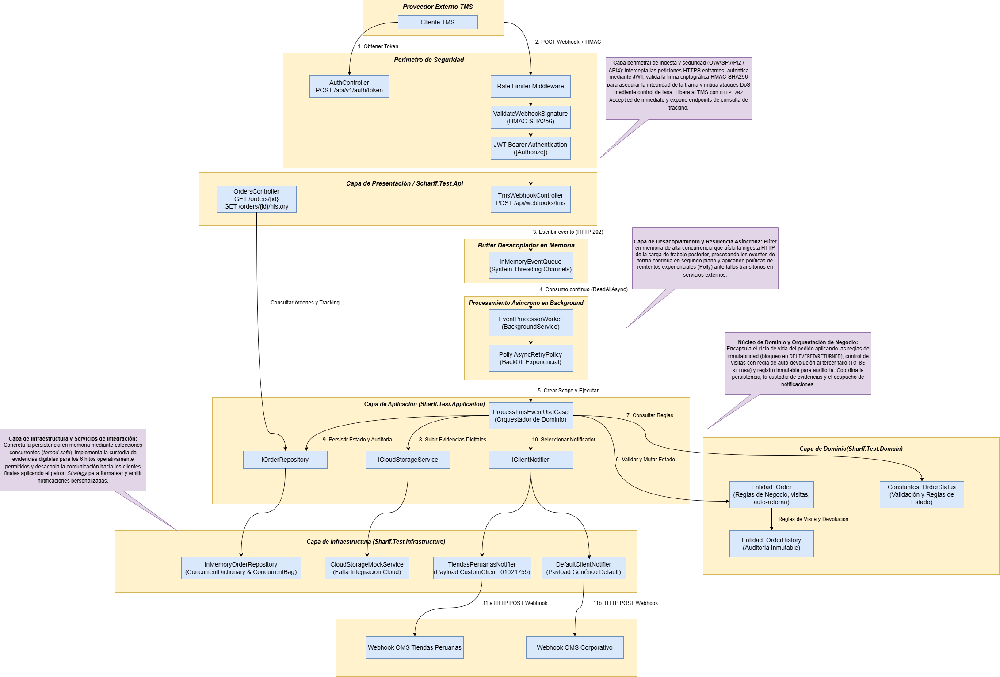

# Logistic TMS to OMS Integration Service

[](https://dotnet.microsoft.com/)
[](https://docs.microsoft.com/dotnet/csharp/)
[](#2-estructura-de-la-solución-clean-architecture)
[](https://opensource.org/licenses/MIT)
[](https://github.com/stivens19/logistic-tms-oms-integration)

Middleware empresarial de alto rendimiento orientado a eventos diseñado para sincronizar en tiempo real el ciclo de vida de pedidos entre un **TMS externo** (Transportation Management System, ej. Beetrack) y el **OMS interno** (Order Management System). 

La solución implementa desacoplamiento asíncrono con colas en memoria de baja latencia (`System.Threading.Channels`), resiliencia con retroceso exponencial (`Polly`), seguridad perimetral de grado financiero (`OWASP API Security`, HMAC-SHA256, JWT, Rate Limiting), auditoría inmutable, custodia selectiva de evidencias digitales y notificaciones multicliente basadas en el patrón Strategy.

---

## 1. Diagrama de Arquitectura

El siguiente diagrama detalla la arquitectura de integración, el perímetro de seguridad, el búfer desacoplador y el flujo de orquestación de negocio:



### Flujo de Datos End-to-End

1. **Autenticación (Paso 1):** El TMS solicita un token JWT seguro a través de `POST /api/v1/auth/token` validando sus credenciales de cliente.
2. **Ingesta Perimetral Segura (Paso 2):** El TMS envía el evento logístico a `POST /api/v1/webhooks/tms` protegido por:
   - **Rate Limiting:** Control de tasa para mitigar ataques DoS y consumo excesivo de memoria (OWASP API4).
   - **HMAC-SHA256 Signature:** Validación de integridad con cabecera `X-Hub-Signature-256` y comparación de tiempo constante (OWASP API2).
   - **JWT Bearer:** Validación del token de acceso autorizado.
3. **Desacoplamiento Inmediato (Paso 3):** El controlador valida el contrato de entrada, deposita el evento en el búfer concurrente en memoria (`InMemoryEventQueue`) y responde de inmediato con `HTTP 202 Accepted` al emisor en menos de 10ms.
4. **Consumo Asíncrono Continuo (Paso 4):** `EventProcessorWorker` (un `BackgroundService`) extrae los eventos del canal en streaming continuo (`ReadAllAsync`) de manera ordenada y sin bloqueo de hilos.
5. **Orquestación Resiliente con Polly (Paso 5):** Cada evento es procesado dentro de una política `Polly AsyncRetryPolicy` con retroceso exponencial (Exponential Backoff) ante fallas transitorias de red o storage.
6. **Inyección de Ámbito y Casos de Uso (Paso 6):** Se resuelve dinámicamente un `IServiceScope` para ejecutar `ProcessTmsEventUseCase`.
7. **Consulta y Mutación de Dominio (Pasos 7 y 8):** El caso de uso consulta la entidad `Order` (Aggregate Root), valida que no esté en estado terminal (`DELIVERED`/`RETURNED`), aplica la transición de estado, contabiliza visitas y evalúa la regla de auto-devolución.
8. **Custodia de Evidencias Digitales (Paso 9):** Si el estado corresponde a uno de los 6 hitos válidos, se invoca `ICloudStorageService` para almacenar fotos y firmas asociadas.
9. **Persistencia e Historial Inmutable (Paso 10):** Se guarda el nuevo estado de la orden y se añade un registro cronológico en `OrderHistory` dentro de `IOrderRepository`.
10. **Notificación Multicliente (Pasos 11a y 11b):** Se resuelve el adaptador `IClientNotifier` correspondiente aplicando el patrón Strategy:
    - **Paso 11.a:** Si el cliente es `01021755`, se dispara el webhook especializado a **Tiendas Peruanas S.A.** con su estructura JSON custom.
    - **Paso 11.b:** Para cualquier otro cliente, se despacha a través de **DefaultClientNotifier** con el contrato unificado.
11. **Consultas de Auditoría y Tracking:** Los sistemas internos (OMS o clientes) consultan en tiempo real el estado actual e histórico mediante `OrdersController` (`GET /api/v1/orders/{orderNumber}/history`).

---

## 2. Tecnologías, Frameworks y Paquetes NuGet

El ecosistema técnico fue seleccionado para maximizar el rendimiento, la mantenibilidad y la robustez operativa bajo el entorno moderno de **.NET 10**:

| Capa / Proyecto | Paquete / Componente | Versión | Rol Arquitectural y Justificación Técnica |
| :--- | :--- | :--- | :--- |
| **Global / Runtime** | **.NET 10 SDK** | `10.0` | Runtime de alto desempeño con optimizaciones JIT, AOT y soporte para C# 13/14. |
| **Api** | `Microsoft.AspNetCore.Authentication.JwtBearer` | `10.0.12` | Autenticación y autorización basada en JSON Web Tokens para endpoints de webhook y consulta. |
| **Api** | `Microsoft.AspNetCore.OpenApi` | `10.0.12` | Metadatos y soporte nativo de especificaciones OpenAPI para documentación interactiva. |
| **Api** | `Swashbuckle.AspNetCore` | `10.3.0` | Generación de interfaz interactiva Swagger UI con soporte para esquemas Bearer Token. |
| **Api** | `Microsoft.AspNetCore.RateLimiting` | *(Nativo .NET 10)* | Middleware perimetral de limitación de tasa basado en ventanas fijas (`AddFixedWindowLimiter`). |
| **Application** | `Microsoft.Extensions.Logging` | `10.0.12` | Abstracción de logging estructurado de alto rendimiento (`ILogger<T>`). |
| **Application** | `System.Text.Json` | *(Nativo .NET 10)* | Serialización JSON de alta velocidad con soporte para `JsonConverter` personalizado (`CustomDateTimeConverter`). |
| **Infrastructure** | `Polly` | `8.8.0` | Motor de resiliencia y tolerancia a fallos transitorios con políticas de reintento (`WaitAndRetryAsync`). |
| **Infrastructure** | `Microsoft.Extensions.Hosting.Abstractions` | `10.0.12` | Soporte para ejecución en segundo plano (`BackgroundService`, `IHostedService`). |
| **Infrastructure** | `Microsoft.Extensions.Http` | `10.0.12` | `IHttpClientFactory` para la gestión óptima de pools de sockets HTTP evitando el agotamiento de puertos TCP. |
| **Infrastructure** | `System.Threading.Channels` | *(Nativo .NET 10)* | Estructura de datos concurrente sin bloqueos (`Channel<T>`) para desacoplamiento asíncrono productor-consumidor. |
| **Infrastructure** | `System.IdentityModel.Tokens.Jwt` | `8.23.0` | Creación y firma criptográfica de tokens JWT (`JwtSecurityTokenHandler`). |
| **Infrastructure** | `Microsoft.IdentityModel.Tokens` | `8.23.0` | Tipos y claves simétricas (`SymmetricSecurityKey`) para validación y firma de tokens. |
| **Domain** | *(Sin dependencias externas)* | `-` | Núcleo de dominio puro (Plain Old C# Objects - POCO), aislado de frameworks de persistencia o APIs. |
| **UnitTests** | `xunit` | `2.9.3` | Framework estándar para ejecución de pruebas unitarias. |
| **UnitTests** | `xunit.runner.visualstudio` | `3.1.4` | Integración de pruebas con Visual Studio Test Explorer y CLI (`dotnet test`). |
| **UnitTests** | `Moq` | `4.21.0` | Framework de mocking para aislar dependencias de infraestructura y repositorios en pruebas de aplicación. |
| **UnitTests** | `FluentAssertions` | `8.11.0` | Aserciones expresivas y legibles para pruebas unitarias de dominio y casos de uso. |
| **UnitTests** | `coverlet.collector` | `6.0.4` | Recolector de métricas de cobertura de código para pipelines de integración continua (CI/CD). |

---

## 3. Descripción de Componentes

### 3.1 Perímetro de Seguridad e Ingesta HTTP (OWASP API Security)

* **`RateLimiterMiddleware` (`RateLimiterExtensions`):** Filtro perimetral configurado con una ventana fija de 30 solicitudes por minuto por endpoint. Mitiga ataques DoS y agotamiento irrestricto de memoria (**OWASP API4: Unrestricted Resource Consumption**) respondiendo inmediatamente con `429 Too Many Requests`.
* **`ValidateWebhookSignatureAttribute`:** Filtro de acción que intercepta peticiones al Webhook verificando la cabecera `X-Hub-Signature-256`. Computa el HMAC con clave compartida y valida mediante `CryptographicOperations.FixedTimeEquals` para evitar ataques de canal lateral por análisis de tiempos (**Timing Attacks - OWASP API2: Broken Authentication & Integrity**).
* **`TmsWebhookController`:** Controlador que expone `POST /api/v1/webhooks/tms`. Realiza validaciones sintácticas y de estados permitidos, encola el evento en memoria y responde `HTTP 202 Accepted` de forma inmediata liberando los hilos del TMS externo.
* **`AuthController`:** Endpoint `POST /api/v1/auth/token` que entrega tokens JWT con firma HMAC-SHA256 y tiempo de vida configurable, asegurando que solo emisores autorizados invoquen los endpoints de ingesta.
* **`OrdersController`:** Endpoints REST (`GET /api/v1/orders/{orderNumber}` y `GET /api/v1/orders/{orderNumber}/history`) para la consulta de estado consolidado y trazabilidad histórica del pedido para los sistemas OMS o tracking de cara al cliente.

### 3.2 Desacoplamiento Asíncrono y Resiliencia

* **`InMemoryEventQueue` (`System.Threading.Channels`):** Búfer en memoria de ultra-alta velocidad y acceso concurrente sin bloqueos (`Channel.CreateUnbounded<TmsEventDto>()`). Separa por completo el ciclo de vida de la petición HTTP del procesamiento de reglas de negocio pesadas.
* **`EventProcessorWorker` (`BackgroundService`):** Proceso en segundo plano gestionado por el host que consume los eventos del canal en streaming asíncrono continuo (`ReadAllAsync(CancellationToken)`), garantizando procesamiento secuencial ordenado y cero pérdida de eventos.
* **`Polly AsyncRetryPolicy`:** Política de tolerancia a fallos con retroceso exponencial (Exponential Backoff: `200ms`, `400ms`, `600ms`) que protege las llamadas a servicios externos de almacenamiento (Cloud Storage) y notificación HTTP a clientes finales ante interrupciones de red transitorias.

### 3.3 Capa de Aplicación y Dominio Logístico

* **`ProcessTmsEventUseCase`:** Orquestador de dominio. Gestiona la recuperación/creación del agregado `Order`, ejecuta las validaciones de negocio, despacha la custodia de evidencias, persiste el nuevo estado y el historial de auditoría, e invoca el adaptador de notificación correspondiente.
* **Entidad `Order` (Aggregate Root):** Encapsula el ciclo de vida completo de la orden protegiendo sus invariantes:
  * **Inmutabilidad de Estados Finales:** Bloquea cualquier modificación posterior si el pedido ya alcanzó un estado terminal (`DELIVERED` o `RETURNED`), lanzando excepción de negocio.
  * **Contador de Visitas:** Incrementa en `+1` el conteo de visitas exclusivamente ante los hitos operativos `DELIVERED` y `NOT DELIVERED`.
  * **Regla de Auto-Devolución:** Si el contador de visitas alcanza 3 intentos fallidos (y el evento actual no es entrega exitosa), auto-emite y transiciona automáticamente el estado del pedido a `TO BE RETURN`.
* **Entidad `OrderHistory`:** Modelo inmutable para auditoría y trazabilidad cronológica con identificador único (`Guid`), estado, sub-estado, courier, fecha de ocurrencia del TMS y marca de tiempo de procesamiento interno en UTC.

### 3.4 Capa de Infraestructura e Integraciones Externas

* **`InMemoryOrderRepository`:** Repositorio en memoria thread-safe implementado con `ConcurrentDictionary<string, Order>` para órdenes y `ConcurrentBag<OrderHistory>` para el histórico de auditoría, garantizando aislamiento y alto rendimiento sin acoplamiento a una base de datos física.
* **`CloudStorageMockService`:** Servicio de almacenamiento en nube (simulador de AWS S3 / Azure Blob Storage) que custodia URLs de fotos y firmas digitales exclusivamente en los 6 hitos válidos de entrega/recolecta.
* **Adaptadores de Notificación (`IClientNotifier` - Strategy):**
  * `TiendasPeruanasNotifier`: Genera el contrato JSON personalizado para el cliente corporativo `01021755` (TIENDAS PERUANAS S.A.) con claves en español y arreglo de evidencias.
  * `DefaultClientNotifier`: Notificador genérico de respaldo que formatea los eventos para cualquier otro cliente integrado al OMS.

---

## 4. Justificación de Patrones de Integración y Diseño

| Patrón de Integración / Diseño | Requisitos Abordados | Justificación Técnica y Aplicación en la Solución |
| :--- | :--- | :--- |
| **Asynchronous Ingestion & Event-Driven Consumer** | • **Req 1:** Recepción de eventos vía webhook<br>• **Req 7:** Canal asincrónico para notificaciones | El TMS envía miles de eventos al día. Procesar reglas, evidencias y notificaciones en la misma petición HTTP saturaría el servidor y causaría caídas por timeout. Se usa `System.Threading.Channels` para encolar el evento al instante y responder de inmediato con `HTTP 202 Accepted`, dejando que un worker en segundo plano haga el trabajo pesado sin demorar al emisor. |
| **Strategy / Message Translator** | • **Req 7:** Notificación multicliente con estructuras propias | Para soportar los distintos formatos (JSON/XML) de cada cliente sin recurrir a bloques complejos de `if/else`, se aplicó el patrón **Strategy** con la interfaz `IClientNotifier`. Esto cumple el principio **Open/Closed (OCP)**, permitiendo integrar nuevos clientes simplemente agregando una clase sin modificar el flujo central del caso de uso. |
| **Retry con Exponential Backoff** | • **Req 8:** Gestión automática de reintentos y consistencia | Las llamadas externas a la nube y clientes sufren fallos de red transitorios. Con **Polly**, se implementó reintentos con *exponential backoff* para recuperar peticiones fallidas sin saturar los servicios receptores, garantizando la entrega de eventos sin pérdidas. |
| **Content Filter & Content-Based Router** | • **Req 6:** Almacenamiento condicional de evidencias | El TMS envía URLs de fotos y firmas en muchos eventos, pero el negocio solo exige guardarlas en 6 hitos clave (`COLLECTED`, `NOT COLLECTED`, `DELIVERED`, `NOT DELIVERED`, `RETURNED` y `NOT RETURNED`). El orquestador filtra el estado antes de llamar a `ICloudStorageService`, evitando descargas y costos innecesarios de almacenamiento en etapas preliminares como `PLANNING` o `STARTED`. |
| **Idempotent Receiver & Aggregate Root** | • **Req 2:** Inmutabilidad de estados finales<br>• **Req 3:** Contador de visitas (+1)<br>• **Req 4:** Devolución automática (`TO BE RETURN`) | Las fallas de red en última milla provocan webhooks duplicados. Como **Aggregate Root**, la entidad `Order` protege las reglas del negocio: bloquea cambios si ya está en estado final (`DELIVERED`/`RETURNED`), cuenta las visitas con cada intento y pasa automáticamente a `TO BE RETURN` al acumular 3 entregas fallidas. |

---

## 5. Estructura de la Solución (Clean Architecture)

El proyecto implementa estrictamente **Clean Architecture**, asegurando desacoplamiento total del dominio respecto a detalles de infraestructura:

```text
Scharff.Test/
│
├── arquitectura.png                         # Diagrama de arquitectura del sistema
├── README.md                                # Documentación técnica integral
├── Scharff.Test.slnx                        # Solución en formato XML moderno de .NET 10
│
├── Scharff.Test.Domain/                     # Capa de Dominio (POCO, Reglas e Invariantes)
│   ├── Constants/
│   │   └── OrderStatus.cs                   # Catálogo de estados, estados terminales y validadores
│   └── Entities/
│       ├── Order.cs                         # Aggregate Root: visitas, terminalidad y auto-retorno
│       └── OrderHistory.cs                  # Entidad inmutable de auditoría y trazabilidad histórica
│
├── Scharff.Test.Application/                # Capa de Aplicación (Casos de Uso y Abstracciones)
│   ├── Common/
│   │   └── CustomDateTimeConverter.cs       # Conversor flexible de fechas (ISO 8601 y formatos TMS)
│   ├── Configuration/
│   │   └── IntegrationOptions.cs            # POCO de configuración fuertemente tipado
│   ├── DTOs/
│   │   └── TmsEventDto.cs                   # Contratos de entrada recibidos desde el webhook del TMS
│   ├── Interfaces/
│   │   ├── IOrderRepository.cs              # Contrato de persistencia de órdenes e histórico
│   │   ├── ICloudStorageService.cs          # Contrato de almacenamiento de evidencias digitales
│   │   ├── IClientNotifier.cs               # Estrategia de notificación multicliente
│   │   └── ITokenService.cs                 # Contrato de generación de tokens JWT
│   └── UseCases/
│       └── ProcessTmsEventUseCase.cs        # Orquestador del flujo y ejecución de reglas
│
├── Scharff.Test.Infrastructure/             # Capa de Infraestructura (Implementaciones Técnicas)
│   ├── Notifications/
│   │   └── ClientNotifiers.cs               # TiendasPeruanasNotifier (01021755) y DefaultClientNotifier
│   ├── Persistence/
│   │   └── InMemoryOrderRepository.cs       # Almacenamiento thread-safe (ConcurrentDictionary / ConcurrentBag)
│   ├── Queues/
│   │   └── InMemoryEventQueue.cs            # Búfer asíncrono basado en System.Threading.Channels
│   ├── Services/
│   │   └── JwtTokenService.cs               # Generación y firma de tokens JWT para autenticación
│   ├── Storage/
│   │   └── CloudStorageMockService.cs       # Custodia y subida simulada a Azure Blob / AWS S3
│   └── Workers/
│       └── EventProcessorWorker.cs          # BackgroundService consumidor con políticas Polly
│
├── Scharff.Test.Api/                        # Capa de Presentación / Entrada REST
│   ├── Controllers/
│   │   ├── AuthController.cs                # Generación de tokens JWT (POST /api/v1/auth/token)
│   │   ├── OrdersController.cs              # Consulta de órdenes y trazabilidad histórica
│   │   └── TmsWebhookController.cs          # Ingesta protegida de eventos (POST /api/v1/webhooks/tms)
│   ├── Extensions/
│   │   ├── DependencyInjection.cs           # Registro de servicios del contenedor de IoC
│   │   ├── RateLimiterExtensions.cs         # Configuración del limitador de tasa
│   │   └── ServiceCollectionExtensions.cs   # Configuración de Swagger OpenAPI y autenticación JWT
│   ├── Filters/
│   │   └── ValidateWebhookSignatureAttribute.cs # Validación HMAC-SHA256 con FixedTimeEquals
│   ├── Program.cs                           # Pipeline HTTP y arranque de la aplicación ASP.NET Core
│   └── appsettings.json                     # Variables de entorno y configuración base
│
└── Scharff.Test.UnitTests/                  # Pruebas Unitarias Automatizadas
    ├── Application/
    │   └── ProcessTmsEventUseCaseTests.cs   # Pruebas de orquestador y mocks de storage/notificador
    └── Domain/
        └── OrderTests.cs                    # Pruebas de invariantes de la entidad Order
```

---

## 6. Catálogo de Estados y Reglas de Negocio

El sistema procesa los estados del ciclo de vida logístico aplicando las siguientes reglas de negocio:

| Estado TMS | Descripción Operativa | ¿Es Estado Terminal? | ¿Incrementa Visitas? | ¿Custodia Evidencias? |
| :--- | :--- | :---: | :---: | :---: |
| `PLANNING` | Orden asignada a ruta de distribución | ❌ No | ❌ No | ❌ No |
| `STARTED` | Courier inició la ruta hacia el destino | ❌ No | ❌ No | ❌ No |
| `AT PICKUP POINT` | Courier arribó al punto de recolección | ❌ No | ❌ No | ❌ No |
| `COLLECTED` | Mercadería recolectada en almacén/tienda | ❌ No | ❌ No | ✅ Sí |
| `NOT COLLECTED` | Fallo en la recolección de mercadería | ❌ No | ❌ No | ✅ Sí |
| `DELIVERED` | Entrega exitosa al destinatario | ✅ **Sí (Inmutable)** | ✅ **Sí (+1)** | ✅ Sí |
| `NOT DELIVERED` | Visita realizada sin entrega exitosa | ❌ No | ✅ **Sí (+1)** | ✅ Sí |
| `TO BE RETURN` | Orden en proceso de retorno por fallos | ❌ No | ❌ No | ❌ No |
| `RETURNED` | Mercadería devuelta a almacén origen | ✅ **Sí (Inmutable)** | ❌ No | ✅ Sí |
| `NOT RETURNED` | Fallo en el proceso de retorno | ❌ No | ❌ No | ✅ Sí |

### Reglas Clave del Negocio
1. **Inmutabilidad Absoluta:** Si un pedido alcanza `DELIVERED` o `RETURNED`, cualquier evento posterior es rechazado inmediatamente protegiendo la consistencia del OMS.
2. **Auto-Devolución en 3 Visitas Fallidas:** Cuando el contador de visitas alcanza 3 intentos y el pedido aún no ha sido entregado (`NOT DELIVERED`), el sistema transiciona automáticamente la orden a `TO BE RETURN`.
3. **Custodia Selectiva de Evidencias:** Solamente se almacenan fotos y firmas digitales para los 6 hitos con impacto probatorio (`COLLECTED`, `NOT COLLECTED`, `DELIVERED`, `NOT DELIVERED`, `RETURNED`, `NOT RETURNED`), ahorrando consumo de storage en hitos intermedios.

---

## 7. Seguridad y Especificación de Endpoints (OWASP API Security)

### 7.1 Autenticación (`POST /api/v1/auth/token`)
Genera un token JWT para autorizar llamadas a los webhooks protegidos.

* **Headers:** `Content-Type: application/json`
* **Request Body:**
```json
{
  "clientId": "beetrack-tms",
  "clientSecret": "secret123"
}
```
* **Response `200 OK`:**
```json
{
  "access_token": "eyJhbGciOiJIUzI1NiIsInR5cCI6IkpXVCJ9...",
  "token_type": "Bearer"
}
```

---

### 7.2 Ingesta de Eventos TMS (`POST /api/v1/webhooks/tms`)
Recibe y encola de manera asíncrona los eventos emitidos por el TMS.

* **Headers Obligatorios:**
  * `Authorization: Bearer <token_jwt>`
  * `X-Hub-Signature-256: sha256=<hmac_sha256_hex>` *(Clave secreta configurada en `IntegrationConfig:TmsApiKey`)*
  * `Content-Type: application/json`
* **Validación Criptográfica:** El filtro computa el hash HMAC-SHA256 del cuerpo exacto de la petición y lo compara en tiempo constante (`CryptographicOperations.FixedTimeEquals`).
* **Ejemplo de Payload Completo:**
```json
{
  "serviceType": "LAST_MILE",
  "dispatchType": "HOME_DELIVERY",
  "status": "NOT DELIVERED",
  "subStatus": "CUSTOMER_ABSENT",
  "vehicleCode": "M1-4432",
  "courierName": "Juan Pérez",
  "eventDate": "2026-10-09 14:30:00",
  "details": {
    "orderNumber": "ORD-2026-9901",
    "trackingNumber": "TRK-8831002",
    "clientCode": "01021755",
    "clientName": "TIENDAS PERUANAS S.A.",
    "receivedBy": null,
    "comments": "El cliente no se encontraba en el domicilio tras 15 minutos de espera.",
    "evidencias": [
      {
        "label": "FotoFachada",
        "fileType": "image/jpeg",
        "fileName": "fachada_visita1.jpg",
        "url": "https://tms-evidence.s3.amazonaws.com/uploads/fachada_visita1.jpg"
      }
    ]
  }
}
```
* **Response `202 Accepted`:**
```json
{
  "message": "Evento recibido y encolado satisfactoriamente para su procesamiento asíncrono.",
  "orderNumber": "ORD-2026-9901",
  "status": "NOT DELIVERED"
}
```

---

### 7.3 Consulta de Órdenes e Historial de Auditoría

* **Estado Actual de la Orden:** `GET /api/v1/orders/{orderNumber}`
  ```json
  {
    "orderNumber": "ORD-2026-9901",
    "clientCode": "01021755",
    "currentStatus": "NOT DELIVERED",
    "visitCount": 1,
    "storedEvidenceUrls": [
      "https://storage.empresa.blob.core.windows.net/evidencias/ORD-2026-9901/fachada_visita1.jpg"
    ],
    "lastUpdatedAt": "2026-10-09T14:30:05.120Z"
  }
  ```

* **Historial de Auditoría Inmutable:** `GET /api/v1/orders/{orderNumber}/history`
  ```json
  [
    {
      "id": "e4b6c3d1-92f7-49f3-8b7a-8b1e4c029a11",
      "orderNumber": "ORD-2026-9901",
      "status": "STARTED",
      "subStatus": "EN_RUTA",
      "courierName": "Juan Pérez",
      "eventDate": "2026-10-09T13:00:00Z",
      "processedAt": "2026-10-09T13:00:02.100Z"
    },
    {
      "id": "a1b2c3d4-e5f6-4a5b-9c8d-7e6f5a4b3c2d",
      "orderNumber": "ORD-2026-9901",
      "status": "NOT DELIVERED",
      "subStatus": "CUSTOMER_ABSENT",
      "courierName": "Juan Pérez",
      "eventDate": "2026-10-09T14:30:00Z",
      "processedAt": "2026-10-09T14:30:05.150Z"
    }
  ]
  ```

---

## 8. Configuración (`appsettings.json`)

Los parámetros del sistema se gestionan a través del *Options Pattern* y pueden sobreescribirse mediante variables de entorno para entornos Docker / Kubernetes:

```json
{
  "Logging": {
    "LogLevel": {
      "Default": "Information",
      "Microsoft.AspNetCore": "Warning"
    }
  },
  "AllowedHosts": "*",
  "IntegrationConfig": {
    "StorageBaseUrl": "https://storage.empresa.blob.core.windows.net/evidencias",
    "TiendasPeruanasWebhookUrl": "https://webhook.site/864a16c7-f41b-4273-9fdf-61750e26d981",
    "DefaultWebhookUrl": "https://webhook.site/850c2e47-2e25-423b-b6ba-18db7e035b21",
    "MaxDeliveryAttempts": 3,
    "RetryMaxAttempts": 3,
    "RetryBaseDelayMilliseconds": 200,
    "TmsApiKey": "local-dev-api-key-12345"
  },
  "JwtSettings": {
    "SecretKey": "SuperSecretClaveParaFirmarTokensJwtDeLogisticaTMS2026",
    "Issuer": "LogisticIntegrationApi",
    "Audience": "TMS_OMS_Clients",
    "ExpirationMinutes": 120
  },
  "Credentials": {
    "AUTH_CLIENT_ID": "beetrack-tms",
    "AUTH_CLIENT_SECRET": "secret123"
  }
}
```

---

## 9. Pruebas Unitarias y Cobertura

La solución cuenta con un proyecto de pruebas unitarias (`Scharff.Test.UnitTests`) que valida el comportamiento del dominio y los casos de uso:

* **Pruebas de Dominio (`OrderTests.cs`):**
  * `ApplyEventStatus_WhenDeliveredOrNotDelivered_ShouldIncrementVisitCount`: Valida el incremento de visitas ante entregas e intentos fallidos.
  * `ApplyEventStatus_WhenVisitsReachThreeAndNotDelivered_ShouldChangeStatusToToBeReturn`: Valida la transición automática al estado de devolución tras 3 visitas fallidas.
  * `ApplyEventStatus_WhenAlreadyInTerminalStatus_ShouldThrowInvalidOperationException`: Valida que pedidos en estados terminales rechacen cualquier cambio posterior.
* **Pruebas de Aplicación (`ProcessTmsEventUseCaseTests.cs`):**
  * `ExecuteAsync_WhenStatusAllowsEvidence_ShouldCallStorageService`: Valida que los 6 hitos clave invoquen la custodia de evidencias en el servicio cloud.
  * `ExecuteAsync_WhenStatusDoesNotAllowEvidence_ShouldNotCallStorageService`: Valida que estados intermedios como `PLANNING` no consuman storage innecesario.

### Ejecución de Pruebas
Para ejecutar toda la suite de pruebas desde la terminal:

```bash
dotnet test
```

Resultado obtenido:
```text
Serie de pruebas para Scharff.Test.UnitTests.dll (.NETCoreApp,Version=v10.0)
Correctas! - Con error: 0, Superado: 5, Omitido: 0, Total: 5, Duración: 102 ms
```

---

## 10. Guía de Ejecución Local

### Prerrequisitos
* [.NET 10 SDK](https://dotnet.microsoft.com/download/dotnet/10.0) instalado en el sistema.
* Git para clonación del repositorio.

### Pasos para iniciar el servicio

1. **Clonar el repositorio:**
   ```bash
   git clone https://github.com/stivens19/logistic-tms-oms-integration.git
   cd logistic-tms-oms-integration
   ```

2. **Restaurar paquetes y compilar la solución:**
   ```bash
   dotnet restore
   dotnet build --configuration Release
   ```

3. **Ejecutar la API:**
   ```bash
   dotnet run --project Scharff.Test.Api
   ```

4. **Acceder a la documentación Swagger:**
   Abrir el navegador web en:
   * `http://localhost:5240/swagger` (o `https://localhost:7194/swagger`)

---

## 11. Colección y Entornos de Postman (Postman Collection & Environments)

Para facilitar la prueba integral de todos los escenarios operativos, reglas de negocio y restricciones de seguridad, el repositorio incluye los artefactos oficiales de Postman listos para importar:

* **Colección:** [`Scharff.postman_collection.json`](file:///d:/.NET%20ESTUDIOS/Scharff.Test/Scharff.postman_collection.json) (v2.1)
* **Entorno:** [`SCHARFF_API.postman_environment.json`](file:///d:/.NET%20ESTUDIOS/Scharff.Test/SCHARFF_API.postman_environment.json)

---

### 11.1 Variables del Entorno (`SCHARFF_API`)

| Variable | Tipo | Valor por Defecto / Local | Descripción |
| :--- | :---: | :--- | :--- |
| `url` | Default | `http://localhost:5240/api/v1` | URL base de la API REST para enrutar todas las peticiones. |
| `jwt_token` | Secret | *(Dinámico)* | Token JWT Bearer generado automáticamente tras ejecutar la petición de Login. |
| `tms_api_key` | Default | `local-dev-api-key-12345` | Clave secreta compartida utilizada para generar la firma criptográfica HMAC-SHA256. |
| `payload_pesado` | Default | *(Dinámico)* | Variable en memoria utilizada en pruebas de límite de tamaño de carga (>2 MB). |

---

### 11.2 Estructura y Escenarios de Prueba en la Colección

La colección se encuentra estructurada en tres carpetas temáticas con scripts automatizados de pre-solicitud (*Pre-request Script*) y aserciones (*Tests*):

#### 1. Carpeta `AUTH`
* **`login` (`POST {{url}}/auth/token`):**
  * Envía las credenciales autorizadas del TMS (`beetrack-tms` / `secret123`).
  * **Test Script Automático:** Valida respuesta `200 OK`, extrae el `access_token` y lo almacena automáticamente en la variable de entorno `{{jwt_token}}` sin requerir copia manual:
    ```javascript
    if (pm.response.code === 200) {
        const responseData = pm.response.json();
        const token = responseData.access_token || responseData.token;
        if (token) {
            pm.environment.set("jwt_token", token);
        }
    }
    ```

#### 2. Carpeta `WEBHOOK`
*Hereda automáticamente la autenticación Bearer Token de la carpeta mediante `{{jwt_token}}`.*

* **Flujo Operativo de Recojo (`Pickup`):**
  * `PLANNING`: Verifica inicio de orden asignada a ruta sin descarga de evidencias.
  * `STARTED`: Conductor en trayecto hacia el punto de recolección.
  * `AT PICKUP POINT`: Vehículo estacionado en andén.
  * `COLLECTED`: Recolección exitosa con guía firmada y foto de paquete, activando la custodia en Cloud Storage.
* **Recojo Fallido (`NOT COLLECTED`):**
  * Caso donde el local está cerrado; guarda evidencia del rechazo y despacha la notificación multicliente al adaptador estándar (`DEFAULT`).
* **Regla de 3 Visitas Fallidas y Auto-emisión:**
  * Petición repetida `REINTENTOS` sobre la orden `ORD-FALLAS-3V` (`NOT DELIVERED`). Al ejecutarse 3 veces consecutivas, el agregado `Order` incrementa el contador a 3 y conmuta el estado de manera autónoma a `TO BE RETURN`.
* **Evento Directo `TO BE RETURN`:**
  * Valida la asignación manual/directa a devolución sin requerir almacenamiento de evidencias.
* **Flujo de Devolución al Cliente:**
  * `NOT RETURNED`: Rechazo en almacén con acta firmada (almacena evidencia).
  * `RETURNED`: Retorno exitoso al almacén con firma de recepción; transiciona a estado terminal inmutable.
* **Entrega Exitosa y Bloqueo de Estados Terminales:**
  * `DELIVERED`: Entrega final al cliente con foto, llevando la orden a estado final.
  * `Intento de modificación sobre orden terminal (Validación de bloqueo)`: Intenta enviar un estado posterior (`STARTED`) sobre la misma orden ya entregada; el sistema detecta la terminalidad y descarta la mutación preservando la consistencia.
* **Validación de Errores de Entrada (HTTP 400 Bad Request):**
  * `Campos Obligatorios`: Prueba con `orderNumber` vacío.
  * `EstadosNoReconocidos`: Prueba con un estado no contemplado en el catálogo (`ESTADONORECONOCIDO`).
* **`PRODUCTION_TEST`:**
  * `PROD_TEST`: Incluye un script pre-request en JavaScript con `CryptoJS` que normaliza saltos de línea (CRLF a LF), calcula dinámicamente el hash `HMAC-SHA256` con `{{tms_api_key}}` e inyecta la cabecera `X-Hub-Signature-256: sha256=...` en tiempo real para simular al emisor en producción.
  * `TEST_PAYLOAD_PESADO`: Genera una cadena de 2.5 MB en pre-request para validar que el middleware rechaza peticiones que superen el límite perimetral de tamaño (`[RequestSizeLimit(2 * 1024 * 1024)]`).

#### 3. Carpeta `ORDERS`
* **`history` (`GET {{url}}/orders/ORD-FALLAS-3V/history`):**
  * Consulta el log cronológico de auditoría inmutable de la orden con todos los estados por los que ha transitado, permitiendo validar la trazabilidad completa.

---

### 11.3 Instrucciones de Uso en Postman

1. **Importar los archivos en Postman:**
   * En Postman, hacer clic en el botón **Import** (esquina superior izquierda).
   * Arrastrar o seleccionar los dos archivos:
     * `Scharff.postman_collection.json`
     * `SCHARFF_API.postman_environment.json`
2. **Seleccionar el Entorno:**
   * En el selector de entornos (esquina superior derecha), seleccionar **SCHARFF_API**.
   * Verificar que la variable `url` coincida con la URL local de la API (ejemplo: `http://localhost:5240/api/v1`).
3. **Autenticación Inicial:**
   * Abrir la carpeta **AUTH** y enviar la petición **login**.
   * La respuesta devolverá `200 OK` y actualizará automáticamente la variable `jwt_token`.
4. **Ejecutar Pruebas:**
   * Ir a la carpeta **WEBHOOK** y ejecutar los escenarios en secuencia o de forma individual según la regla que se desee auditar.

---

## 12. Repositorio Oficial

El código fuente del proyecto se encuentra disponible en:
* **GitHub:** [https://github.com/stivens19/logistic-tms-oms-integration](https://github.com/stivens19/logistic-tms-oms-integration)